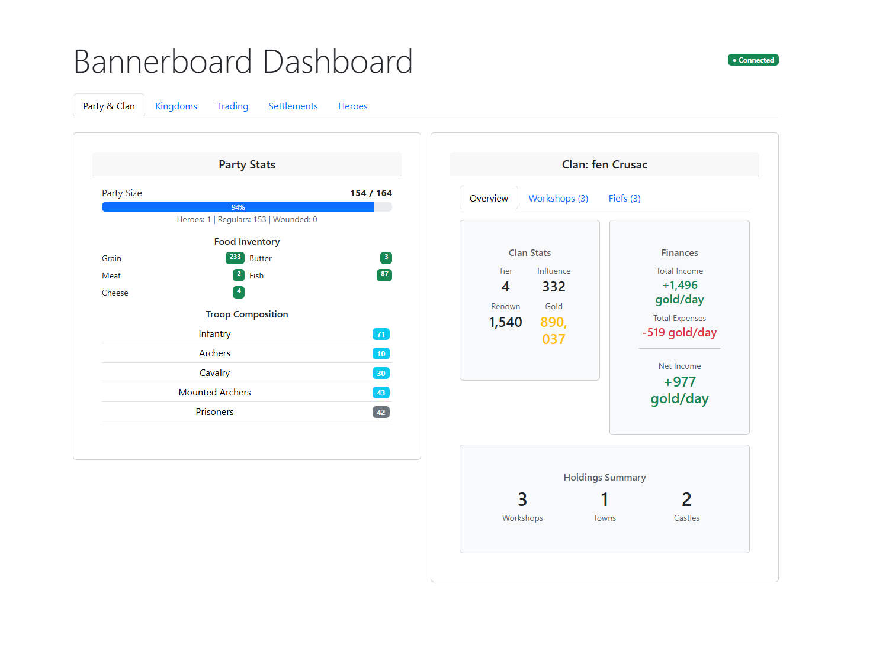
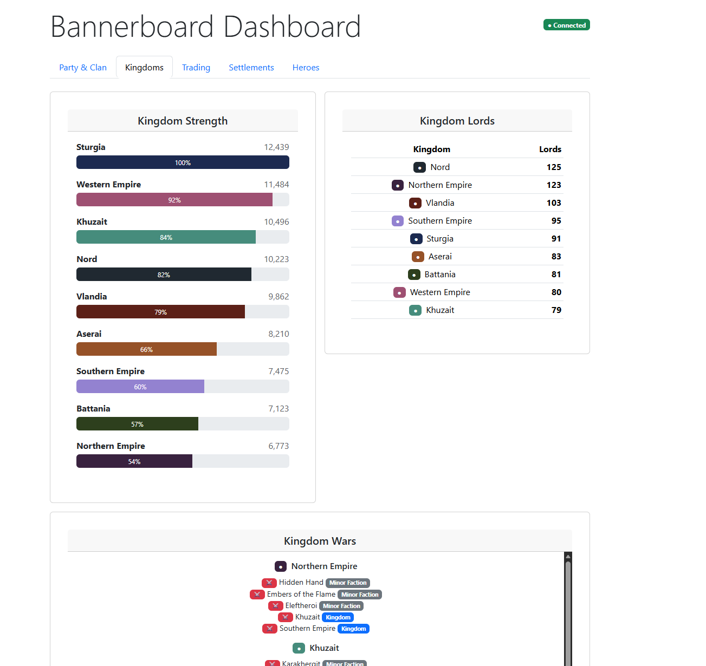
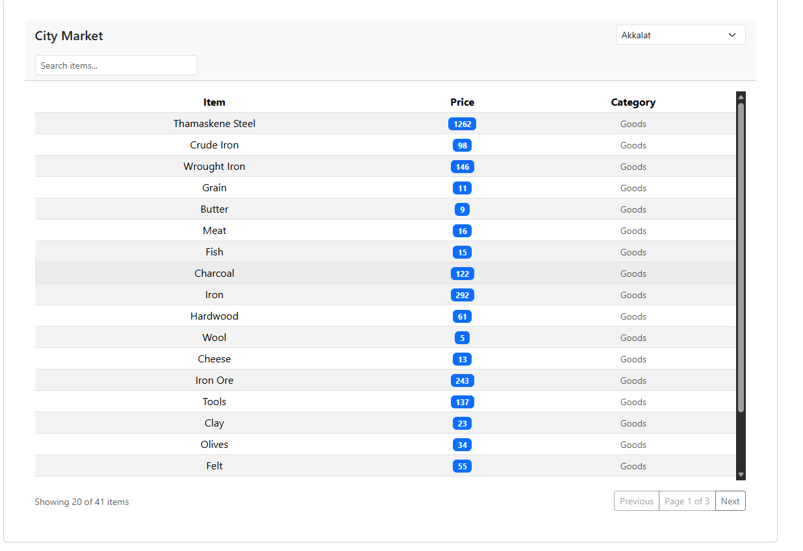
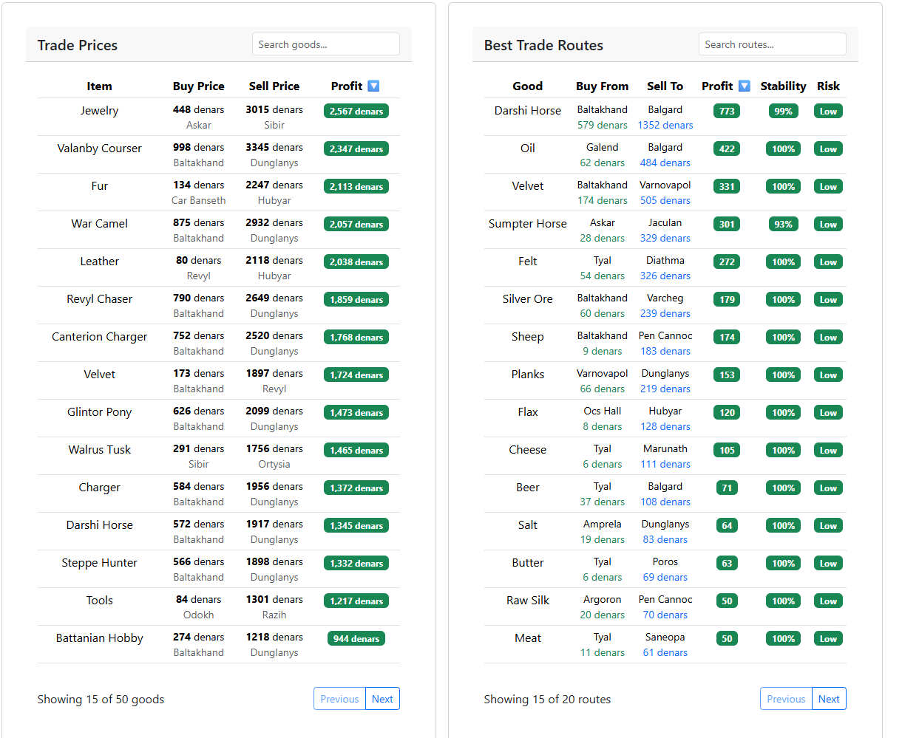
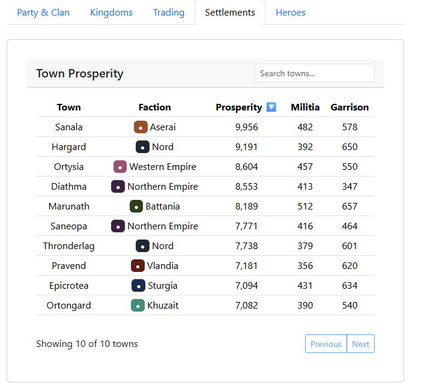

# BannerboardLocal

**BannerboardLocal** is a comprehensive dashboard mod for *Mount & Blade II: Bannerlord* that displays real-time game data in a web browser. It runs a local web server alongside the game, allowing you to view detailed analytics, track world events, and optimize your trading strategy on a second monitor, tablet, or phone.

The dashboard is a modern Single Page Application (SPA) built with **React** and **Bootstrap 5**, communicating with the game via WebSockets for instant updates.

This mod is forked from and completely ripping off of the original Bannerboard mod: https://github.com/edgarssults/Bannerboard
I added my own things I wanted and made it run locally without the need for accessing an Azure site. 

## Features

-   **Real-Time Dashboard**: Updates instantly as you play.
-   **Modern UI**: Clean, responsive interface that works on any device with a browser.
-   **Zero External Traffic**: All data is processed locally on your machine. No data is sent to the internet.
-   **Comprehensive Data**: Covers everything from your party's finances to global kingdom politics.

## Dashboard Tabs & Widgets

The dashboard is organized into five main tabs to help you manage different aspects of your campaign:

### 1. Party & Clan
Manage your immediate entourage and family affairs.
-   **Party Stats**: Real-time metrics on your party's morale, speed, food, and wage costs.
-   **Clan Info**: A detailed overview of your clan's status:
    -   **Overview**: Renown, Influence, Tier, and Gold.
    -   **Finances**: Daily income vs. expenses breakdown.
    -   **Workshops**: Status, location, and profitability of your workshops.
    -   **Fiefs**: Management stats for your towns and castles (Prosperity, Loyalty, Garrison, etc.).

### 2. Kingdoms
Keep an eye on the geopolitical landscape.
-   **Kingdom Strength**: Comparative charts showing the military strength (Troops), political power (Clans), and territory (Fiefs) of all kingdoms.
-   **Kingdom Lords**: A searchable list of all lords in each kingdom, including their clan affiliations.
-   **Kingdom Wars**: Current diplomatic status, showing active wars and peace treaties.

### 3. Trading
Maximize your profits with advanced market intelligence.
-   **Market Table**: A searchable database of item prices and stock levels for any town you've visited (or have trade rumors for).
-   **Trade Prices**: A global overview of trade goods, highlighting the absolute lowest buy prices and highest sell prices currently available in the world.
-   **Trade Routes**: Automatically calculated profitable trade routes. The mod analyzes market data to suggest where to buy low and sell high for maximum profit.

### 4. Settlements
Monitor the prosperity and development of the world.
-   **Town Prosperity**: A global ranking of towns by prosperity. Use this to identify rich targets for conquest or struggling fiefs that need investment.

### 5. Heroes
Track important characters across Calradia.
-   **Hero Tracker**: A tool to search for and track the last known location and status (Active, Dead, Disabled) of any hero in the game. Perfect for hunting down enemy lords or finding potential spouses.

## Dependencies

To ensure the mod functions correctly and to access the in-game settings menu, you must install the following dependencies (available on Steam Workshop and Nexus Mods):

1.  **Harmony**
2.  **ButterLib**
3.  **UIExtenderEx**
4.  **Mod Configuration Menu (MCM)**

*Note: When installing MCM on Steam, it should prompt you to subscribe to the other required dependencies automatically.*

## Usage

1.  Ensure all dependencies listed above are installed and enabled.
2.  Enable **Bannerboard** in the Bannerlord launcher.
3.  Launch the game.
4.  Once in the campaign map, open your web browser and navigate to: `http://localhost:8080` (default port).

## Credits

-   **UI Framework**: React, Bootstrap 5
-   **Server**: EmbedIO, SuperSocket
-   **Icons**: [Freepik](https://www.flaticon.com/authors/freepik) from [Flaticon](https://www.flaticon.com), [Game-icons.net](https://game-icons.net)

## Links

-   **Original mod:**
-   **Nexus Mods**: [Bannerboard on Nexus](https://www.nexusmods.com/mountandblade2bannerlord/mods/3386)
-   **Steam Workshop**: [Bannerboard on Steam](https://steamcommunity.com/sharedfiles/filedetails/?id=2876851738)
